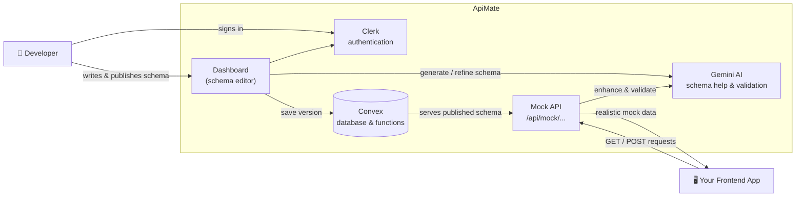

<div align="center">


# ApiMate

**Build your frontend before your backend exists.**

Define a schema, publish it, and get a live mock API in seconds — no backend required.

[](https://nextjs.org)
[](https://convex.dev)
[](https://clerk.dev)
[](https://ai.google.dev)

[**Live Demo**](https://api-mate-gamma.vercel.app) &nbsp;·&nbsp; [Report a Bug](../../issues) &nbsp;·&nbsp; [Request a Feature](../../issues)

</div>

<br>

## Contents

- [Overview](#overview)
- [Features](#features)
- [How It Works](#how-it-works)
- [Architecture at a Glance](#architecture-at-a-glance)
- [Quick Start](#quick-start)
- [Configuration](#configuration)
- [Using the Mock API](#using-the-mock-api)
- [Tech Stack](#tech-stack)
- [Deploying to Production](#deploying-to-production)
- [Project Structure](#project-structure)
- [Roadmap](#roadmap)
- [Contributing](#contributing)
- [Support](#support)

<br>

## Overview

Frontend teams are often blocked waiting on a backend that isn't ready yet. ApiMate removes that dependency.

Instead of waiting on real endpoints, you describe the shape of your data as a schema. ApiMate turns that schema into a **live, working API** that returns realistic sample data immediately — so UI work, QA, and demos can start on day one. When the real backend ships, you swap one URL and move on.

```
Define Schema  →  Publish  →  Get a Live Endpoint  →  Build Your UI  →  Swap URL When Ready
```

<br>

## Features

| | Feature | What it does |
|---|---|---|
| 🧩 | **Contracts & Projects** | Organize API definitions by project, with full versioning per contract |
| 🤖 | **AI Schema Generation** | Describe an API in plain English and let AI draft the schema for you |
| 🔌 | **Live Mock Endpoints** | Every published schema is instantly callable as a real HTTP endpoint |
| ⚠️ | **Breaking Change Detection** | Automatically flags removed fields, changed types, and new requirements between versions |
| ✅ | **Request Validation** | Send real payloads to your mock endpoint and get instant pass/fail feedback with AI-suggested fixes |
| 🎭 | **Realistic Fake Data** | Responses use believable values (names, emails, prices, dates) instead of `"string"` and `"foo"` |
| 💻 | **Client Code Generation** | Generate ready-to-use Dart and Java model classes straight from a schema |
| ⏪ | **Version History** | Every version is kept and can be restored at any time |
| 🔐 | **Private by Default** | Every project is scoped to its owner — nothing is public unless you make it so |

<br>

## How It Works

1. **Create a project** — a container for a related set of APIs (e.g. "Checkout Service").
2. **Add a contract** — give it a name and a path, like `User Profile → /api/users`.
3. **Define the schema** — write JSON Schema by hand, or describe it in plain English and let AI generate it.
4. **Publish a version** — ApiMate validates it, checks it against the previous version for breaking changes, and locks it in as an immutable version.
5. **Call your live endpoint** — start building against real HTTP responses immediately.
6. **Swap the URL later** — point your app at the real backend once it's ready. No code changes beyond the base URL.

<details>
<summary><strong>Example schema →  example response</strong></summary>

<br>

**Schema you define:**

```json
{
  "type": "object",
  "properties": {
    "id":    { "type": "integer" },
    "name":  { "type": "string" },
    "email": { "type": "string", "format": "email" },
    "role":  { "enum": ["admin", "user"] }
  },
  "required": ["id", "name", "email"]
}
```

**What your endpoint returns:**

```json
{ "id": 1847, "name": "Jordan Lee", "email": "j.lee@acme.io", "role": "admin" }
```

</details>

<br>

## Architecture at a Glance



Everything a schema needs — versioning, validation, and mock data — lives behind one endpoint your frontend can call like a real API. Deeper diagrams (data flow, security layers) are in [`docs/ARCHITECTURE.md`](docs/ARCHITECTURE.md).

<br>

## Quick Start

### Prerequisites

| Requirement | Purpose |
|---|---|
| Node.js 18+ | Runtime |
| [Convex](https://convex.dev) account | Database & backend functions |
| [Clerk](https://clerk.dev) account | User authentication |
| [Google AI Studio](https://aistudio.google.com) API key | Powers AI schema generation & validation help |

### Install & Run

```bash
git clone https://github.com/rohanwani10/api_mate.git
cd api_mate

npm install

cp .env.local.example .env.local   # then fill in your keys — see Configuration below

npm run dev                        # starts the app + backend together
```

The app runs at `http://localhost:3000`.

### Available Scripts

| Command | What it does |
|---|---|
| `npm run dev` | Runs the app and backend locally, side by side |
| `npm run build` | Creates a production build |
| `npm run start` | Serves the production build |
| `npm run lint` | Checks code quality |

<br>

## Configuration

Create a `.env.local` file in the project root with the following:

```env
# Convex (backend & database)
CONVEX_DEPLOYMENT=your-convex-deployment-slug
NEXT_PUBLIC_CONVEX_URL=https://your-deployment.convex.cloud

# Clerk (authentication)
NEXT_PUBLIC_CLERK_PUBLISHABLE_KEY=pk_...
CLERK_SECRET_KEY=sk_...
```

> **Note:** The Gemini API key (`GEMINI_API_KEY`) powers AI features and must be set in your **Convex dashboard's environment variables**, not in `.env.local` — it's used server-side only.

<br>

## Using the Mock API

Once a schema is published, it's live at:

```
GET  /api/mock/{contractId}/{versionNumber}/{path}    # fetch mock data
POST /api/mock/{contractId}/{versionNumber}/{path}    # validate a payload
```

**Fetching mock data**

```bash
curl https://your-app.com/api/mock/abc123/1/users
```

```json
{ "id": 1847, "name": "Jordan Lee", "email": "j.lee@acme.io", "role": "admin" }
```

Add `?count=5` to get an array of items, or `?mode=fast` to skip AI enhancement for instant responses.

**Validating a payload**

```bash
curl -X POST https://your-app.com/api/mock/abc123/1/users \
  -H "Content-Type: application/json" \
  -d '{"id": 1, "name": "Alex Kim", "email": "not-an-email"}'
```

```json
{
  "error": "Contract Mismatch",
  "details": [{ "instancePath": "/email", "message": "must match format \"email\"" }],
  "properResponse": { "id": 1, "name": "Alex Kim", "email": "alex.kim@example.com", "role": "user" },
  "explanation": "The email field was missing a valid format. Updated to a properly formatted address."
}
```

Mock endpoints are rate-limited to 100 requests per IP per 60 seconds. Full endpoint behavior, response codes, and internals are documented in [`docs/ARCHITECTURE.md`](docs/ARCHITECTURE.md).

<br>

## Tech Stack

| Layer | Technology |
|---|---|
| Framework | Next.js 16 (App Router) + React 19 + TypeScript |
| Backend & Database | Convex |
| Authentication | Clerk |
| AI | Google Gemini |
| Validation | AJV (JSON Schema) |
| Styling | Tailwind CSS |

<br>

## Deploying to Production

ApiMate's mock endpoints rely on fully dynamic API routes. Before deploying, confirm your hosting platform supports this:

- ✅ **Node.js server** (`npm run build && npm start`)
- ✅ **Docker / containerized environments**
- ⚠️ **Vercel Hobby / static-first platforms** may need adaptation for dynamic route segments

For a deeper look at the architecture, data model, and security design, see [`docs/ARCHITECTURE.md`](docs/ARCHITECTURE.md).

<br>

## Project Structure

<details>
<summary>Expand to view the folder layout</summary>

```
apimate/
├── app/
│   ├── api/mock/[contractId]/[version]/[...path]/   # Live mock endpoint
│   ├── dashboard/                                    # Authenticated app (projects, contracts, settings)
│   └── page.tsx                                      # Public landing page
├── components/
│   ├── Home/                                          # Landing page sections
│   ├── Dashboard/                                      # Dashboard UI
│   └── SchemaWorkspace.tsx                            # Core schema editor + AI assistant
├── convex/
│   ├── schema.ts                                       # Database schema
│   ├── contracts.ts                                    # Project/contract/version logic
│   ├── ai.ts                                           # AI schema generation
│   └── utils.ts                                        # Breaking change detection
├── lib/codegen.ts                                       # Dart + Java code generators
└── public/                                              # Static assets
```

</details>

<br>

## Roadmap

**Coming next**
- Team collaboration with role-based access
- Import existing OpenAPI specs
- Configurable response delay simulation
- Request logging for debugging

**Planned**
- Webhook simulation
- GraphQL support
- Auto-generated SDKs (TypeScript, Python, Go)
- Contract testing against real backends

See the full list in [`docs/ARCHITECTURE.md`](docs/ARCHITECTURE.md#roadmap).

<br>

## Contributing

Contributions are welcome. Please open an issue first to discuss significant changes.

```bash
git checkout -b feature/your-feature-name
git commit -m "feat: describe your change"
git push origin feature/your-feature-name
```

Run `npm run lint` before opening a pull request.

<br>

## Support

- 🐛 Found a bug? [Open an issue](../../issues)
- 💡 Have an idea? [Request a feature](../../issues)
- 📖 Want implementation details? See [`docs/ARCHITECTURE.md`](docs/ARCHITECTURE.md)

<br>

<div align="center">

Made for frontend developers who don't want to wait.

</div>
